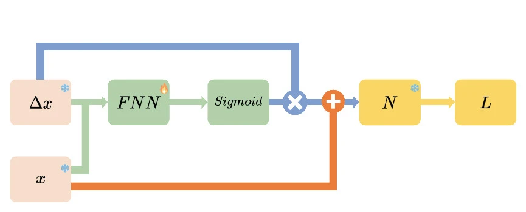

# Minimizing Perturbation Rates in Adversarial Machine Learning through Pruning Techniques

[](https://opensource.org/licenses/MIT)
[](https://2023.ecmlpkdd.org/)

</div>
<table align="center">
  <tr>
    <td align="center"> 
       
      <br>
      <em style="font-size: 18px;">  <strong style="font-size: 18px;">Figure 1:</strong> Architecture of Min-PRv2.</em>
    </td>
  </tr>
</table>


This repository presents the implementation and experimental framework for the research conducted in the study [Minimizing Perturbation Rates in Adversarial Machine Learning through Pruning Techniques](https://link.springer.com/chapter/10.1007/978-3-031-43412-9_9). Our work investigates the reduction of perturbation rates in adversarial examples by leveraging pruning algorithms, aiming to improve the robustness of deep neural networks against adversarial attacks.

## Environment Setup

To replicate our experiments, ensure your environment meets the following prerequisites:

- Python 3.8+
- foolbox==3.3.3
- numpy==1.24.2
- pandas==1.5.3
- Pillow==9.5.0
- PyTorch==2.0.0+cu118
- torchvision==0.15.1+cu118
- tqdm==4.65.0

## Resource Acquisition

Download the necessary model weights and datasets from the following links to conduct the experiments:

- Weights: [Download Here](https://drive.google.com/file/d/1_RCpxcbJHJ5y3V4iCoO8Y0cp_vOeUeGv/view?usp=sharing)
- Data: [Download Here](https://drive.google.com/file/d/1v9mvo5JzVOS7erOhEUQq7GorCVA4e9FI/view?usp=sharing)

## Generating Adversarial Examples

Utilize the `generate_adv.py` script to create adversarial examples prior to experimentation:

```bash
python generate_adv.py --dataset cifar10 --attack linfpgd
```

## Experiment Execution

Post adversarial example generation, execute the main experiment through the `main.py` script:

```bash
python main.py --dataset cifar10 --method total --attack linfpgd --pic_num 1000 --alpha 0.01 --use_label
```

This command initiates the experiment on the CIFAR-10 dataset using the LinfPGD attack method, targeting 1000 images with a step size of 0.01.

## Citation

For academic usage, please cite our paper:

```
@inproceedings{zhu2023towards,
  title={Towards Minimising Perturbation Rate for Adversarial Machine Learning with Pruning},
  author={Zhu, Zhiyu and Zhang, Jiayu and Jin, Zhibo and Wang, Xinyi and Xue, Minhui and Shen, Jun and Choo, Kim-Kwang Raymond and Chen, Huaming},
  booktitle={Joint European Conference on Machine Learning and Knowledge Discovery in Databases},
  pages={147--163},
  year={2023},
  organization={Springer}
}
```
